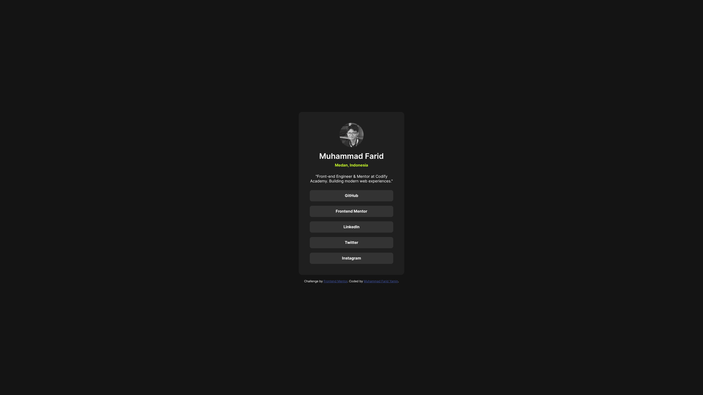
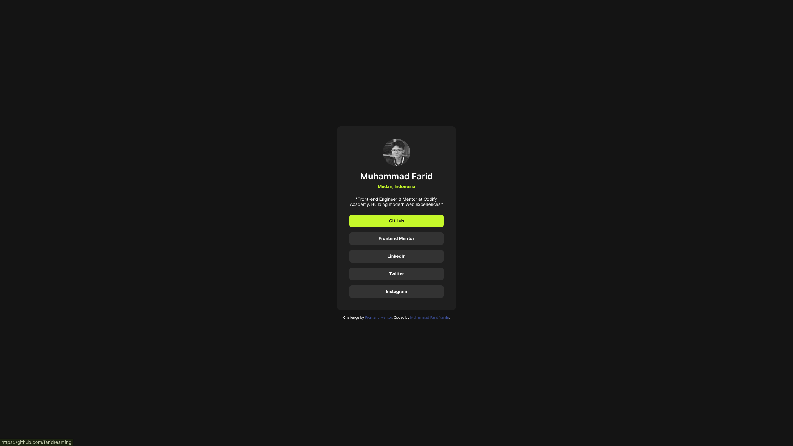

# Frontend Mentor - Social links profile solution

This is a solution to the [Social links profile challenge on Frontend Mentor](https://www.frontendmentor.io/challenges/social-links-profile-UG32l9m6dQ). Frontend Mentor challenges help you improve your coding skills by building realistic projects. 

## Table of contents

- [Frontend Mentor - Social links profile solution](#frontend-mentor---social-links-profile-solution)
  - [Table of contents](#table-of-contents)
  - [Overview](#overview)
    - [The challenge](#the-challenge)
    - [Screenshot](#screenshot)
    - [Links](#links)
  - [My process](#my-process)
    - [Built with](#built-with)
    - [What I learned](#what-i-learned)
    - [AI Collaboration](#ai-collaboration)
  - [Author](#author)

## Overview

### The challenge

Users should be able to:

- See hover and focus states for all interactive elements on the page

### Screenshot

### Links

- Solution URL: [https://github.com/faridreaming/social-links-profile](https://github.com/faridreaming/social-links-profile)
- Live Site URL: [https://faridreaming.github.io/social-links-profile/](https://faridreaming.github.io/social-links-profile/)

## My process

### Built with

- Semantic HTML5 markup
- Modern CSS
- Flexbox

### What I learned

I've learned that I should only put my CSS in one place. I shouldn't put my CSS in both HTML and CSS files at the same time for consistency.

### AI Collaboration

I use Gemini to estimate the sizing of the spaces, font sizes, and border radius.

## Author

- Website - [https://faridreaming.my.id/](https://faridreaming.my.id/)
- Frontend Mentor - [@faridreaming](https://www.frontendmentor.io/profile/faridreaming)
- X - [@faridreaming](https://x.com/faridreaming)
- Instagram - [@frddev](https://www.instagram.com/frddev)
